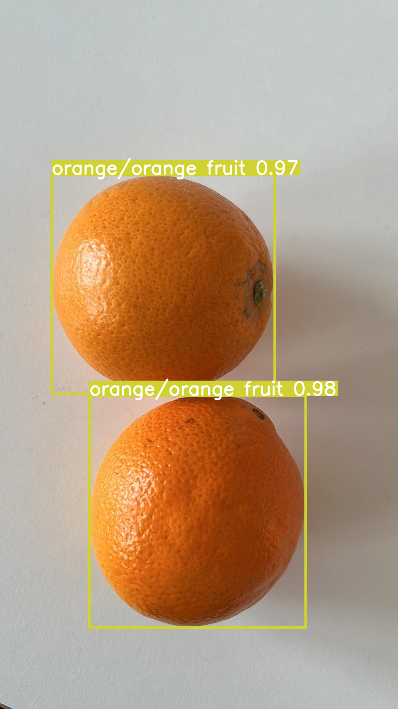

# Fruits-And-Vegetables-Detection-Dataset

**TLDR**: This repo contains ...
- the biggest fruits and vegetable YOLO formatted image dataset for object detection with **63 classes** and **8221 images**.
- three YOLOv8 fine-tuned baseline models (`medium`, `large`, `xlarge`).
- sample application demo for scoring the healthiness of meals
- Test it online **[here](https://hub.ultralytics.com/projects/AIhZh0lIAJko7snRmM5f)** 

## The Dataset

<div>
    
    
    
    
</div>

<div>
    
    
    
    
</div>

- The dataset is a subset of the [LVIS dataset](https://www.lvisdataset.org) which consists of 160k images and 1203 classes for object detection. It is originally COCO-formatted (`.json` based).
- The dataset has been converted from COCO format (`.json`) to YOLO format (`.txt` based)
- All images that do not contain any fruits or images have been removed, resulting in `8221` images and `63` classes (`6721`train, `1500` validation). Additional `180` test images have been manually labelled with Roboflow
- The classes cover most common fruits and vegetables (see [fruits_vegetables_LVIS_dict.json](fruits_vegetables_LVIS_dict.json)
- The `LVIS-Fruits-And-Vegetables-Dataset` has also been uploaded to
    - [Kaggle](https://www.kaggle.com/datasets/henningheyen/lvis-fruits-and-vegetables-dataset) and
    - [Ultralytics Dataset HUB](https://hub.ultralytics.com/datasets/F2NY9oa4vTCPgy9chAe5)

## The Model

Getting started:

```
pip install -r requirements.txt
```

To fine-tune a YOLOv8 model the following code can be used as also shown in the [demo](demo.ipynb):

```
from ultralytics import YOLO

# Load a pretrained model (e.g. YOLOv8m)
model = YOLO('yolov8m.yaml')  # build a new model from YAML

# Fine tuning the model on custom dataset
results = model.train(data='LVIS_Fruits_And_Vegetables/data.yaml', epochs=50, imgsz=640)
```

Training locally can be time-consuming. The models have been trained using Ultrylitics HUB Cloud compute resources. Three models have been trained based on different sizes of the pre-trained models (`yolov8m`, `yolov8l`, `yolov8x). The model weights for each model have been stored in `.pt` format in the [Model_Weights](Model_Weights) folder (just unzip). Performance ranges from `0.152` for the `medium` model to `0.202` for the `xlarge` model measured by mAP50-95 (see [Figure](Figures/mAP50-95 by Model Size.png)).

## Inference

The [demo](demp.ipynb) contains examples of how to run inference. Example images with detection using the `xlarge` model can be found in the [Example_Results](Example_Results) folder. 

To test the models on a web interface check out the **[Ultralytics Inference API](https://hub.ultralytics.com/projects/AIhZh0lIAJko7snRmM5f)** under the `Preview` tab. 

<div>
    
</div>

**Example images from test set**: 
<div>
    
    
    
    
    
</div>

## Sample Application: Meal Scoring

In the [meal_scoring](meal_scoring.ipynb) demo applies the fine-tuned models to score the healthiness of meals. A use case could be that users upload photos of their meals and with one simple and one complex scoring algorithm, the user will then be rewarded points depending on how colourful and healthy the meal is. 

<div>
    
</div>

## Future Steps

- To achieve better performance the class distribution has to be more uniform. As depicted below most detections in the train set are `Bananas`, `Carrots` and `Apples`.

<div>
    
</div>


